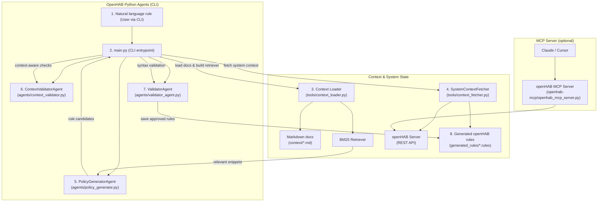

## Architecture Diagram

The diagram below illustrates the natural language to openHAB rule generation flow and the optional MCP server integration, focusing on the main components you interact with.

