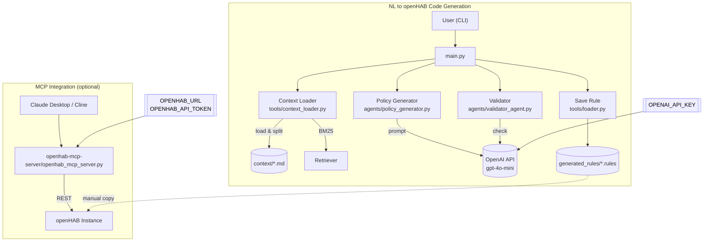

## Architecture Diagram

The diagram below illustrates the natural language to openHAB code generation flow and the optional MCP server integration for controlling a live openHAB instance.

```mermaid
flowchart TD
  %% Natural language to openHAB code generation
  subgraph A["NL to openHAB Code Generation"]
    U["User (CLI)"] --> M["main.py"]
    M --> C["Context Loader<br/>tools/context_loader.py"]
    C -->|"load & split"| D[("context/*.md")]
    C -->|"BM25"| R["Retriever"]
    M --> G["Policy Generator<br/>agents/policy_generator.py"]
    G -->|"prompt"| OA[("OpenAI API<br/>gpt-4o-mini")]
    M --> V["Validator<br/>agents/validator_agent.py"]
    V -->|"check"| OA
    M --> S["Save Rule<br/>tools/loader.py"]
    S --> F[("generated_rules/*.rules")]
  end

  %% MCP integration to control a live openHAB
  subgraph B["MCP Integration (optional)"]
    Asst["Claude Desktop / Cline"] --> Srv["openhab-mcp-server/openhab_mcp_server.py"]
    Srv -->|"REST"| OH["openHAB Instance"]
  end

  %% Deploy rule into openHAB (manual step today)
  F -. "manual copy" .-> OH

  %% Environment variables
  classDef env fill:#eef,stroke:#99f,stroke-width:1px,color:#000
  E1[["OPENAI_API_KEY"]]:::env --> OA
  E2[["OPENHAB_URL<br/>OPENHAB_API_TOKEN"]]:::env --> Srv
```

