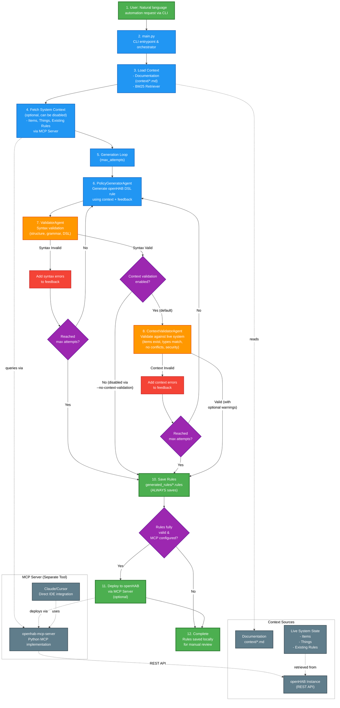

# openHABAgents

openHABAgents is an AI-driven toolkit that turns natural language automation requests into executable openHAB DSL rules. It couples an iterative generation and validation loop with live openHAB context (via the bundled MCP server) so you can move from intent to live automation quickly and safely.

## Overview

The repository consists of:

**Python Agents** (`main.py`) - Orchestrate retrieval-augmented rule generation, iterative validation against live openHAB state, and file management for `.rules` artifacts. The agents talk to openHAB **indirectly via the bundled MCP server** to fetch items, things, and existing rules, and can optionally deploy validated rules back through the same server.


## Key Features

- AI-assisted rule authoring powered by LangChain and the `gpt-4o-mini` chat model.
- **Context-aware validation**: Validates rules against live openHAB system state to prevent undefined items, conflicts, and security issues.
- **Conflict detection**: Analyzes existing rules (both live and locally generated) to detect duplicate triggers and contradictory actions.
- **Security reasoning**: LLM-based security analysis to detect dangerous patterns (HVAC conflicts, infinite loops, etc.).
- Iterative validator loop that incorporates structured feedback until a rule passes quality checks or the retry budget is exhausted.
- **Individual rule file management**: Each generated rule is automatically saved to a separate `.rules` file for better organization and modularity.
- Retrieval over curated documentation in `context/` using the LangChain BM25 retriever.
- Configurable output location via `OPENHAB_RULES_DIR` with sensible defaults (`generated_rules/`).
- Optional automatic deployment to an MCP server by setting `OPENHAB_MCP_URL` (plus token support). (in development)
- Extensible prompt building that records prior candidates and validator feedback for subsequent iterations.

## Quick Start

### Prerequisites

- Python 3.10+ (virtual environments recommended)
- An `OPENAI_API_KEY` with access to the `gpt-4o-mini` model family
- (Optional) An openHAB instance for context-aware validation and deployment
- (Optional) Docker for running openHAB locally

### Installation

1. Clone the repository:
   ```bash
   git clone <repository-url>
   cd openHABAgents
   ```
2. Install Python dependencies:
   ```bash
   pip install -r requirements.txt
   ```
3. Set up openHAB (choose one option):
   
   **Option A: Use existing openHAB instance**
   ```bash
   cp env.example .env
   # Edit .env and add your credentials
   OPENAI_API_KEY=your_openai_api_key_here
   OPENHAB_URL=http://localhost:8080
   OPENHAB_API_TOKEN=your_token_here
   ```
  

### CLI Usage

Run a request and let the agents iterate up to the default three attempts:

```bash
python main.py "Turn on the living room light when motion is detected"
```

Customise output and retry budget:

```bash
python main.py "Turn off all lights at midnight" --out nighttime --max-attempts 5
```

Successful runs write each generated rule to a separate `.rules` file in `generated_rules/` (or the folder pointed to by `OPENHAB_RULES_DIR`) and print a validator summary. The `--out` flag specifies a prefix for the generated files (e.g., `--out nighttime` might create `nighttime_turn_off_all_lights_at_midnight.rules`).

### Optional: MCP Server for Claude/Cursor Integration

The MCP server (`openhab-mcp/`) is shared between:

- The **Python agents**, which launch it as a local MCP stdio server to retrieve live system state (items, things, rules) and validate generated rules against your real installation.
- **Claude Desktop / Cursor / Cline**, which can connect to the same server to let you inspect and control openHAB via natural language inside your IDE.

To set up MCP integration for Claude/Cursor:
1. See `openhab-mcp/README.md` for detailed instructions
2. The MCP server will be invoked on-demand by your AI assistant when you ask questions about your openHAB system

## Project Structure

```
openHABAgents/
├── ARCHITECTURE.md               # High-level system design notes
├── agents/
│   ├── policy_generator.py       # LangChain-based rule generator
│   ├── validator_agent.py        # Syntax validator with JSON verdicts
│   └── context_validator.py      # Live system state validator
├── context/                      # Retrieval corpus (markdown sources)
│   ├── examples_rules.md
│   ├── grammar_reference.md
│   ├── openhab_syntax.md
│   └── tutorials.md
├── generated_rules/              # Default output directory (created on demand)
├── openhab-mcp/                  # MCP server (used by agents and IDE integrations)
│   ├── openhab_client.py         # OpenHAB REST API client (used by MCP server)
│   ├── models.py                 # Data models for items, things, rules
│   ├── openhab_mcp_server.py     # MCP server implementation
│   └── docker-compose.macos.yml  # Run openHAB in Docker
├── tools/
│   ├── context_loader.py         # Builds the BM25 retriever
│   ├── context_fetcher.py        # Fetches live openHAB system state
│   ├── rule_parser.py            # Parses .rules files
│   ├── loader.py                 # File saver with OPENHAB_RULES_DIR support
│   └── prompt_builder.py         # Aggregates context, feedback, and prior code
├── main.py                       # CLI entry point
├── requirements.txt              # Python dependency pinning
├── setup-env.sh                  # Quick setup script
└── README.md
```

See `openhab-mcp/README.md` for MCP server setup (Claude/Cursor integration only).

## Architecture

## Architecture Diagram

The diagram below illustrates the natural language to openHAB rule generation flow and the optional MCP server integration, focusing on the main components you interact with.



## How It Works

1. **Context retrieval**: `tools/context_loader.load_contexts` ingests markdown files from `context/`, splits them with LangChain, and exposes a BM25 retriever for relevant documentation.

2. **Live system context via MCP** (optional): When `OPENHAB_URL` and `OPENHAB_API_TOKEN` are configured:
   - `SystemContextFetcher` launches the bundled MCP server (`openhab-mcp/openhab_mcp_server.py`) as a local stdio server.
   - Through MCP tools it fetches all items, things, and rules from your openHAB instance.
   - It also loads previously generated rules from the `generated_rules/` directory.
   - The result is a unified `SystemContext` object used for validation and conflict detection.

3. **Prompt assembly**: `PromptBuilder` collates the request, retrieved documentation snippets, live system context (if available), and accumulated validator feedback.

4. **AI generation**: `PolicyGeneratorAgent` invokes `gpt-4o-mini` to synthesize a candidate `.rules` file, guided by documentation context and aware of available items and existing rules.

5. **Context-aware validation**: `ContextValidatorAgent` checks the candidate rule against the `SystemContext`:
   - ✓ Verifies all referenced items exist in openHAB
   - ✓ Checks item type compatibility (e.g., can't dim a Switch)
   - ✓ Detects conflicts with existing rules (duplicate triggers, contradictory actions)
   - ✓ Identifies security vulnerabilities (HVAC conflicts, infinite loops, water hazards)
   - ✓ Validates thing status and availability

6. **Syntax validation**: `ValidatorAgent` evaluates DSL syntax and structure, returning structured feedback.

7. **Iterative refinement**: If validation fails, feedback is incorporated and the generation-validation loop continues up to `GENERATION_MAX_ATTEMPTS` times.

8. **Persistence**: Each rule in the validated output is parsed and saved to its own `.rules` file via `tools.loader.save_rule`, respecting `OPENHAB_RULES_DIR` and the `--out` filename prefix. These local `.rules` files are also fed back into the next run’s `SystemContext` for conflict detection.

## Custom Context

Tailor the retrieval corpus to mirror your installation:

1. Add or edit markdown files in `context/` with device-specific examples, naming conventions, or policies.
2. Run `python main.py ...` again; the retriever rebuilds in-memory on each execution, so no extra steps are required.
3. Keep long documents concise and well-structured so BM25 can surface the right fragments.

## Configuration

### Environment Variables

**Required:**
- `OPENAI_API_KEY` - OpenAI API key for LangChain (GPT-4o-mini model)

**For Context-Aware Validation (via MCP):**
- `OPENHAB_URL` - openHAB instance URL (e.g., `http://localhost:8080` or `http://localhost:18080` for Docker)
- `OPENHAB_API_TOKEN` - API token from openHAB (Settings → API Security)
- `ENABLE_CONTEXT_VALIDATION` - Enable/disable live validation (default: `true` if URL/token set). When enabled, `SystemContextFetcher` will launch the MCP server to pull items, things, and rules.

**Optional:**
- `GENERATION_MAX_ATTEMPTS` - Maximum retry attempts (default: `3`)
- `OPENHAB_RULES_DIR` - Output directory for `.rules` files (default: `generated_rules/`)
- `OPENHAB_MCP_COMMAND` / `OPENHAB_MCP_ARGS` - Override how the MCP server is launched (advanced).
- `OPENHAB_MCP_URL` and `OPENHAB_MCP_TOKEN` / `OPENHAB_STAGING_TOKEN` - Configure the HTTP endpoint and auth token used for **rule deployment** via `tools.mcp_client.deploy_rule_via_mcp`. If unset, deployment is skipped but local `.rules` files are still written.

### Command-line Summary

```bash
python main.py [OPTIONS] "<natural language request>"

Options:
  --out PREFIX                Output filename prefix for generated rules (each rule saved separately)
  --max-attempts N            Maximum generator/validator iterations
  --no-context-validation     Disable context-aware validation (skip live system checks)
```

## Using Generated Rules in openHAB

Generated rules are saved to `generated_rules/` (or your configured `OPENHAB_RULES_DIR`). To deploy them:

**Option 1: Manual Deployment**
1. Copy the generated `.rules` files into the `conf/rules/` folder of your openHAB installation
2. openHAB will detect the new rules automatically
3. Monitor openHAB logs to confirm activation

**Option 2: Docker Volume Mount (in development)**
If running openHAB in Docker, mount your `generated_rules/` directory:
```yaml
volumes:
  - ./generated_rules:/openhab/conf/rules
```

**Option 3: Direct REST API Deployment**
Use the openHAB REST API to deploy rules programmatically (future enhancement).

## Development

- Core dependencies are pinned in `requirements.txt` (LangChain, OpenAI SDK, python-dotenv, requests, rank-bm25).
- The MCP server publishes its own `pyproject.toml` with Hatch/Black/Flake8 tooling for contributors.
- Refer to `ARCHITECTURE.md` for design rationale and extension points.

## License

MIT

## Acknowledgments

- Built with [LangChain](https://github.com/langchain-ai/langchain).
- Inspired by the Model Context Protocol initiative.
- Powered by OpenAI models.

## Documentation

📚 **[Complete Documentation Index](DOCUMENTATION_INDEX.md)** - Navigate all documentation

**Quick Links:**
- [FAQ](FAQ.md) - Common questions and troubleshooting
- [Architecture Overview](ARCHITECTURE_OVERVIEW.md) - Understand how everything connects
- [Quick Start Guide](openhab-mcp/QUICK_START.md) - Get running in 3 minutes
- [Setup Guide](openhab-mcp/SETUP_GUIDE.md) - Detailed setup instructions

## Support

- Browse `generated_rules/` for reference outputs
- Review the curated documentation in `context/`
- Consult the official [openHAB documentation](https://www.openhab.org/docs/)


